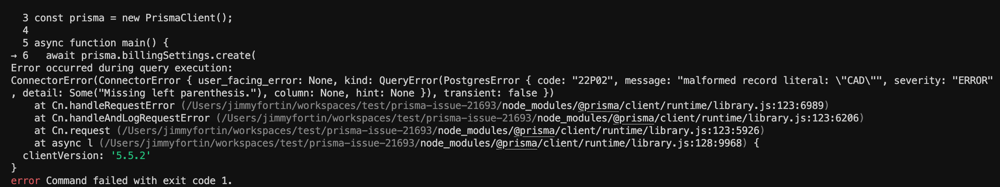

# How to run this project

- Have `docker`, `nodejs` and `yarn` installed on the machine
- Run `yarn` in this folder to install all the dependencies
- Run `yarn start:docker` to deploy the docker container with the postgres database
- Run `yarn migration` to create the tables in the database
- Run `yarn start` to build the prisma schema and execute the typescript code

### Expected result

